[](https://travis-ci.org/deanturpin/dft)
[](https://codecov.io/gh/deanturpin/dft)
Sun 17 Jun 00:55:38 BST 2018
```cpp
#ifndef DFT_H
#define DFT_H

#include <algorithm>
#include <complex>
#include <numeric>
#include <vector>

// DFT is a discrete Fourier transform implementation that uses no third-party
// libraries. Libraries often use optimisations that restrict dimensions of the
// sample array (power of two) but without these limitations we can explore the
// beauty of the algorithm and apply it to problems where we couldn't use a
// "fast" implementation. It was initially written to study the characteristic
// spectral response of my various instruments.
//
// There are a few opportunities for parallelisation here but I've elected to
// keep the library simple (single-threaded) and delegate the multi-core
// utilisation to the makefile.
//
// https://en.wikipedia.org/wiki/Discrete_Fourier_transform
// https://jackschaedler.github.io/circles-sines-signals
// https://en.wikipedia.org/wiki/Overtone

namespace dft {

template <typename Iterator> auto calculate(Iterator begin, Iterator end) {

  // We will return a container of frequency bins
  std::vector<double> dft;

  // For each Fourier bin we need to iterate over each sample - O(n^2) - but
  // return only half as many bins as samples, the upper half is a mirror
  // image of the lower.
  const double bins = std::distance(begin, end);

  // The twiddle matrix is usually generated up front but as we're doing a
  // one-shot calculation it can be refactored into a single loop. Ordinarily
  // integers are used in for-loops but here a floating-point counter is used to
  // avoid a cast in the main calculation.
  for (double k = 0.0; k < bins / 2; ++k) {

    // Loop over every sample for each frequency bin and store the result.
    std::vector<std::complex<double>> fou;
    std::transform(begin, end, std::back_inserter(fou),
                   [ n = 0.0, &bins, &k ](const auto &sample) mutable {

                     // Calculate the response for this sample, note the sample
                     // index (n) is incremented in the calculation.
                     return exp(std::complex<double>{0.0, 2.0} *
                                3.14159265358979323846264338328 * k * n++ /
                                bins) *
                            double(sample);
                   });

    // Store the absolute sum of the responses scaled by the window size.
    dft.push_back(std::abs(std::accumulate(std::cbegin(fou), std::cend(fou),
                                           std::complex<double>{}) /
                           bins));
  }

  return dft;
}
}
#endif
```
# wav/bamboo_drone.wav
[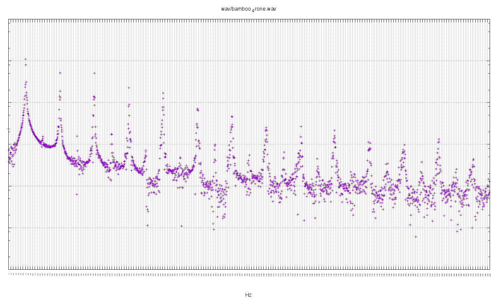](wav/bamboo_drone.wav.png)
Peaks at: 72, 143, 215, 286 and 357 Hz.

A cheap bamboo didge with a Sugru mouthpiece. Fundamental of 72 Hz, slightly
flat of D2, with a full compliment of harmonics across the whole frequency
range. Not a refined sound and quite difficult to play but very responsive.

```
73.42	D2
146.83	D3
220.00	A3
293.66	D4
369.99	F#4
```
Listen to the [audio](wav/bamboo_drone.wav.png).
# wav/didgeridoo_big_tony_drone.wav
[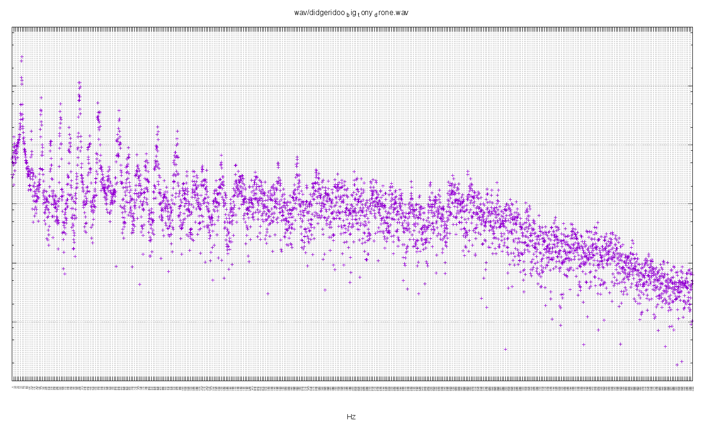](wav/didgeridoo_big_tony_drone.wav.png)
Peaks: 57, 172, 285, 398 Hz.

Fundamental of 57 Hz, slightly flat of concert Bb1. Next loudest peak is 398 Hz
(G4), which is a sixth interval in Bb Major. See [the
scale](https://en.wikipedia.org/wiki/B-flat_major) on Wikipedia.

This didgeridoo was liberated from the dump and is probably Eucalyptus:
woolybutt, bloodwood and stringybark have been discussed.

```
58.27	A#1
174.61	F3
293.66	D4
392.00	G4
```
Listen to the [audio](wav/didgeridoo_big_tony_drone.wav.png).
# wav/didgeridoo_big_tony_toot.wav
[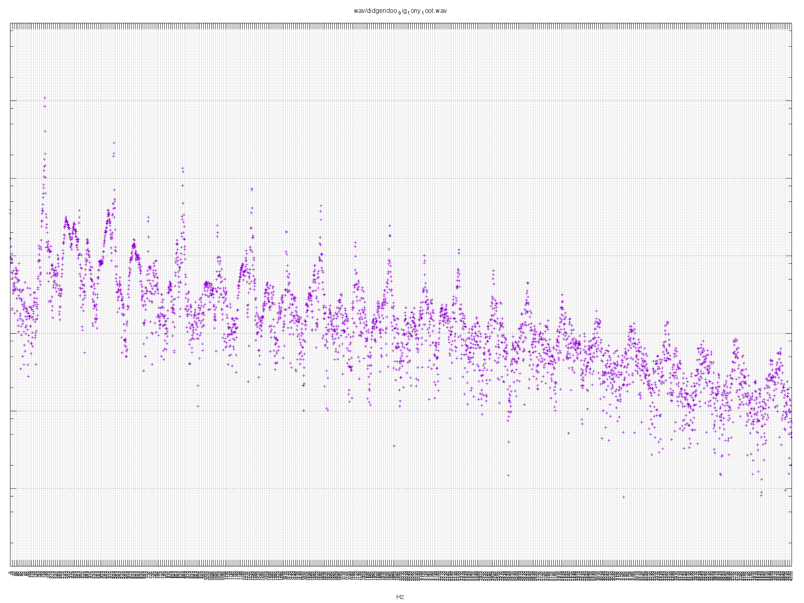](wav/didgeridoo_big_tony_toot.wav.png)
The toot has a fundamental of 178 Hz (F3) which is a fifth above the drone.
There's also lots of activity in the higher frequencies at least up to 4 KHz.
Listen to the [audio](wav/didgeridoo_big_tony_toot.wav.png).
# wav/hobgoblin_didge_8000.wav
[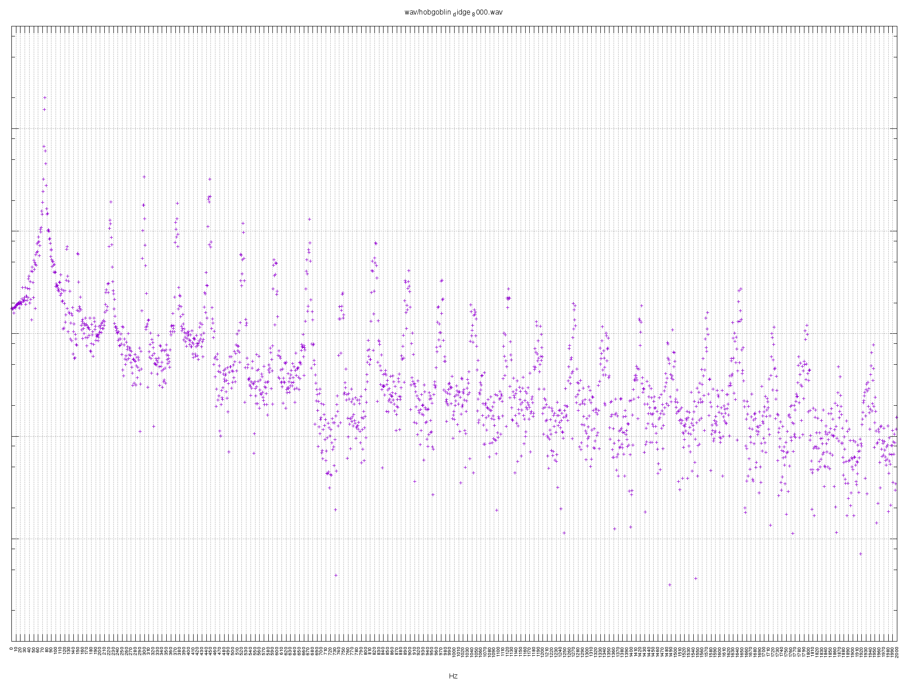](wav/hobgoblin_didge_8000.wav.png)
Peaks at 75, 149, 224, 299 374, 448 Hz.

Fundamental of 75 Hz is somewhere between D2 and D#2. The first octave isn't
very strong but the next few overtones have equal presence. Overall it's
probably tending towards a D-Major.

```
73.42	D2
220.00	A3
293.66	D4
369.99	F#4
440.00	A4
```
Listen to the [audio](wav/hobgoblin_didge_8000.wav.png).
# wav/JF_fibreglass_slide.wav
[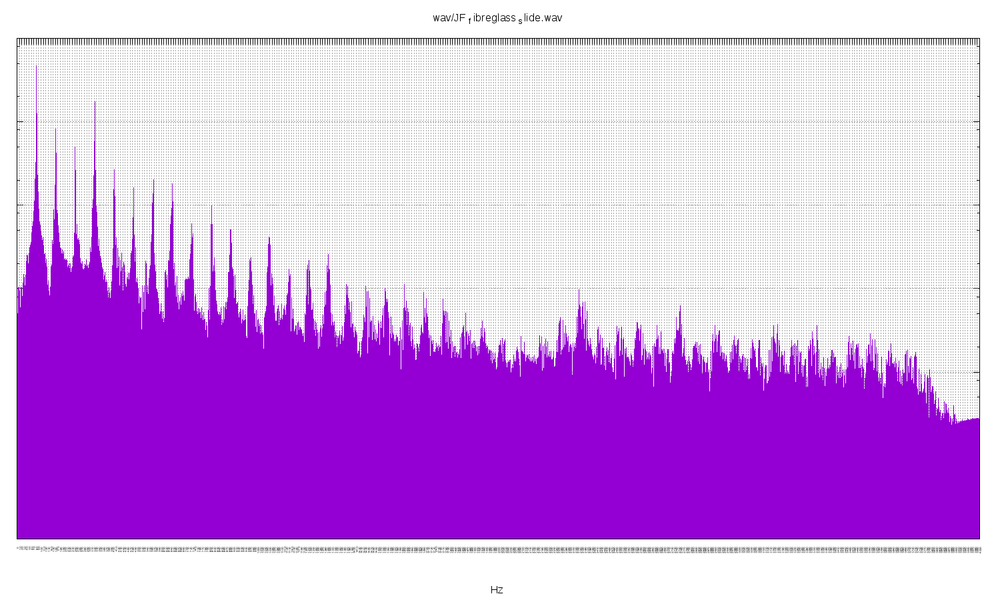](wav/JF_fibreglass_slide.wav.png)
Peaks at: 81, 162, 243, 324 Hz.

A fundamental of 81 Hz, just flat of E2. First octave, fifth (B3) and second
octave all quite strong.

```
82.41	E2
164.81	E3
246.94	B3
329.63	E4
```
Listen to the [audio](wav/JF_fibreglass_slide.wav.png).
# wav/KP_guest.wav
[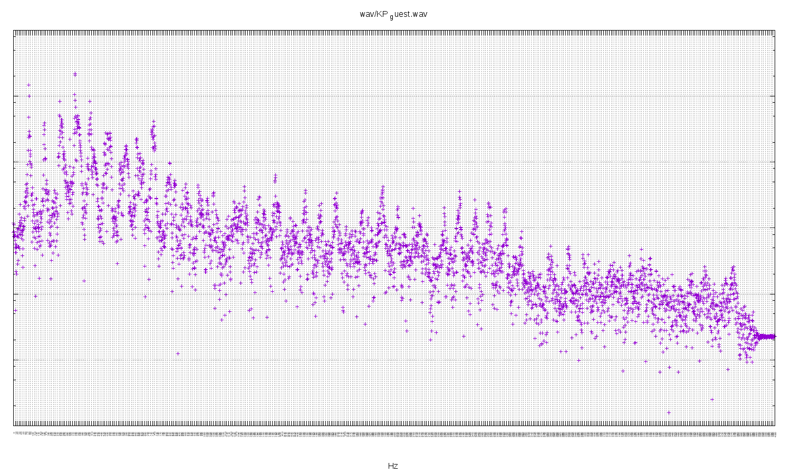](wav/KP_guest.wav.png)
Fundamental of 82 Hz (E2) with two octaves and a fifth (B). There's also a
hint of 403 Hz (a slightly sharp G4): a minor third. See [the
scale](https://en.wikipedia.org/wiki/E_minor) on Wikipedia.

```
82.41	E2
164.81	E3
246.94	B3
329.63	E4
392.00	G4
```
Listen to the [audio](wav/KP_guest.wav.png).
# wav/pianoBb2.wav
[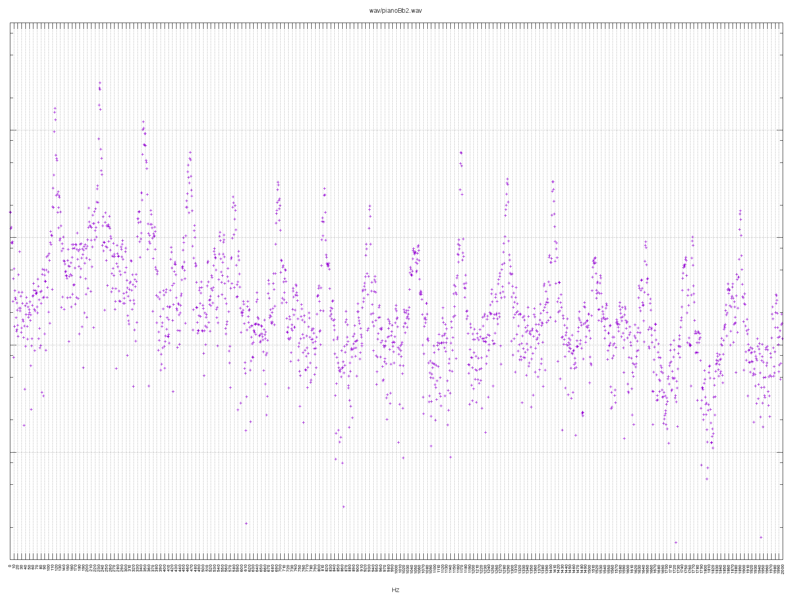](wav/pianoBb2.wav.png)
Striking the A2 key on a baby grand piano (no pedal).
Listen to the [audio](wav/pianoBb2.wav.png).
# wav/singing_bowl1.wav
[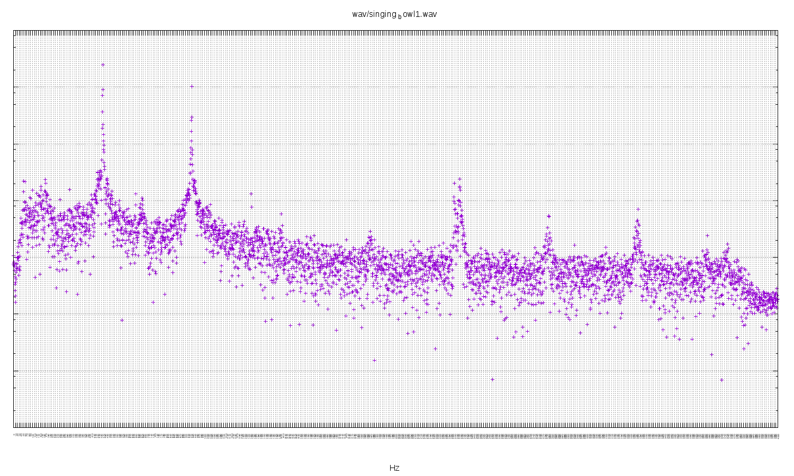](wav/singing_bowl1.wav.png)
Fundamental of 468 Hz (close to A#4) and first octave of 936 Hz. The only bowl
with a pronounced octave. (Note that the second peak is off the right-hand side
of the second plot.)

```
466.16	A#4
932.33	A#5
```
Listen to the [audio](wav/singing_bowl1.wav.png).
# wav/singing_bowl2.wav
[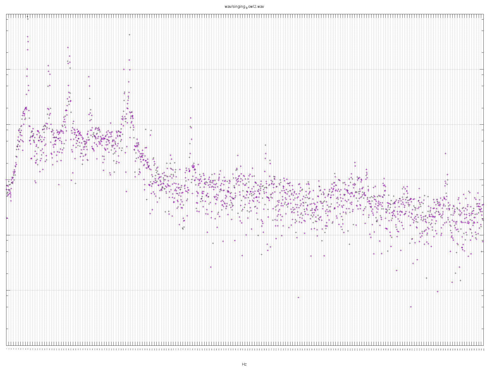](wav/singing_bowl2.wav.png)
Fundamental of 89 Hz, close to F2. Significant peaks at 259 Hz and 517 Hz
(fifths). Very complex response, I suspect this is a hand-made metal bowl. (I
recorded the bowls in the dark so I'm not sure which video was which.)

```
87.31	F2
261.63	C4
523.25	C5
```
Listen to the [audio](wav/singing_bowl2.wav.png).
# wav/singing_bowl3.wav
[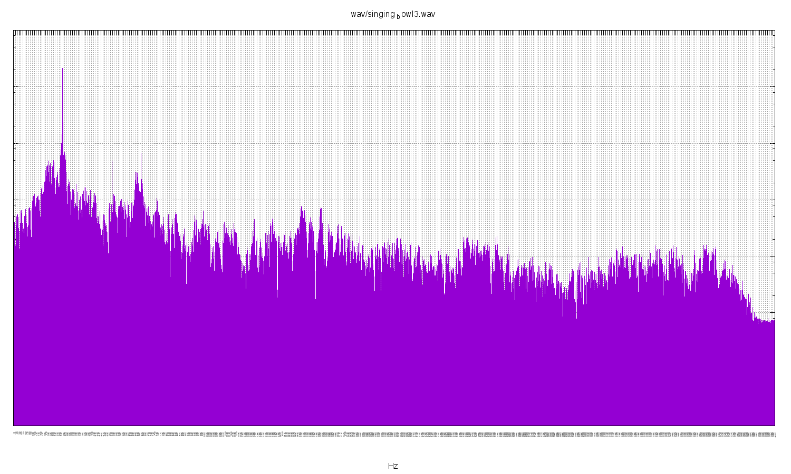](wav/singing_bowl3.wav.png)
Fundamental exactly 260 Hz (close to C4). Very pure, little harmonic noise.

```
261.63	C4
```
Listen to the [audio](wav/singing_bowl3.wav.png).
# wav/singing_bowl5.wav
[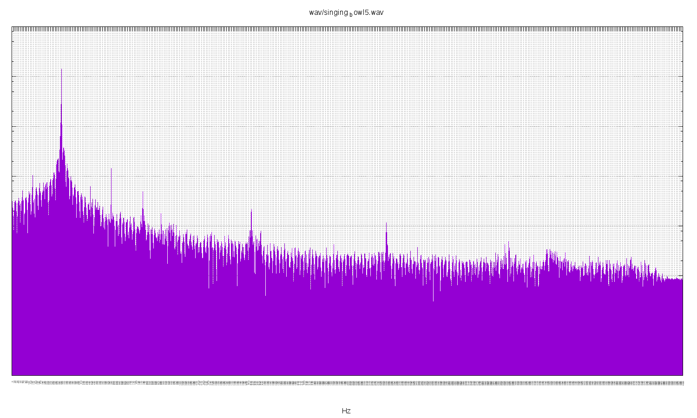](wav/singing_bowl5.wav.png)
Extremely pure fundamental of 297 Hz. Halfway between D4 and D#4.

```
293.66	D4
311.13	D#4
```
Listen to the [audio](wav/singing_bowl5.wav.png).
# wav/synthesised_chord.wav
[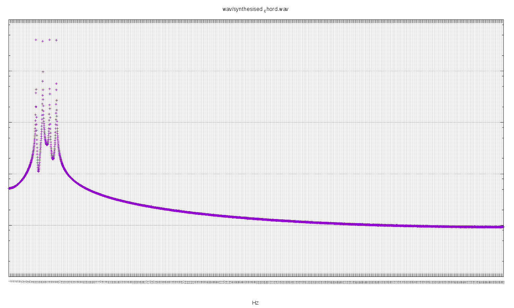](wav/synthesised_chord.wav.png)
Listen to the [audio](wav/synthesised_chord.wav.png).
# wav/synthesised_chord_whole_freqs.wav
[](wav/synthesised_chord_whole_freqs.wav.png)
Listen to the [audio](wav/synthesised_chord_whole_freqs.wav.png).
# wav/synthesised_overtones.wav
[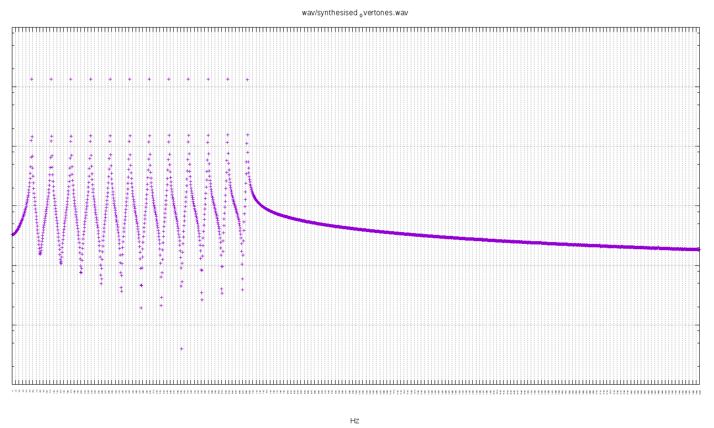](wav/synthesised_overtones.wav.png)
Listen to the [audio](wav/synthesised_overtones.wav.png).
