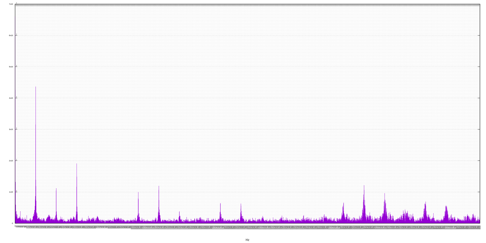
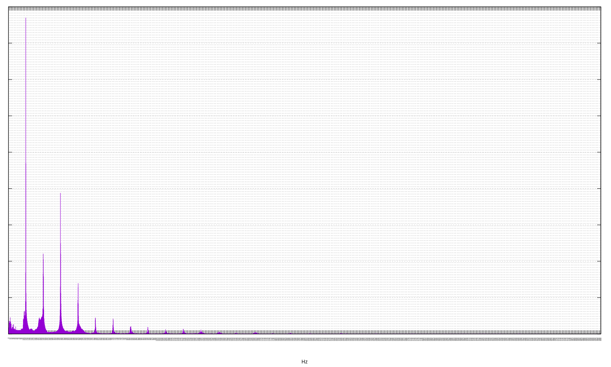
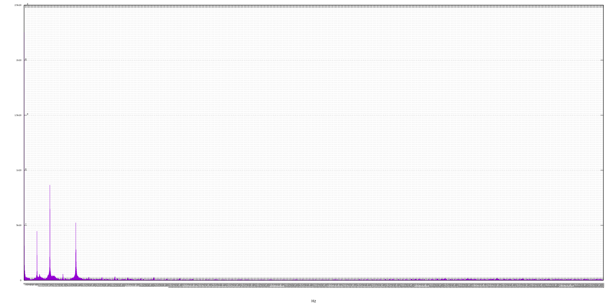
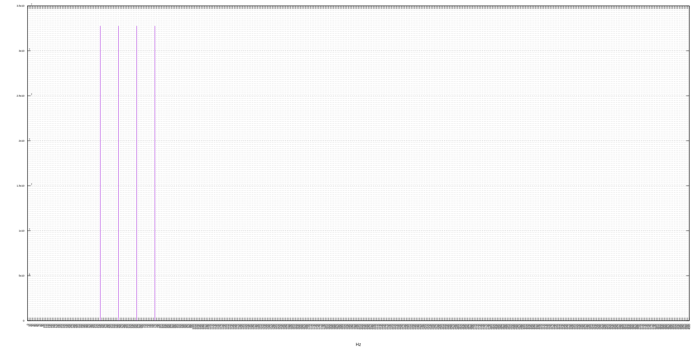

[](https://travis-ci.org/deanturpin/spectrum_analyser_gnuplot)
[](https://codecov.io/gh/deanturpin/spectrum_analyser_gnuplot)

A discrete Fourier transform implementation using no third-party libraries. Initially written to study the spectral response of my digeridoo. See [Wikipedia](https://en.wikipedia.org/wiki/Discrete_Fourier_transform) for the algorithm.

Samples recorded on my Ubuntu laptop with ```arecord```.
```bash
arecord -q -f S16_LE -c1 -r 8000 > recording.wav
```

See the [pitch table](pitch.md) for concert pitch frequencies.

---

Thu  7 Jun 07:17:35 BST 2018
# didgeridoo_big_tony.wav
Listen to the [audio](wav/didgeridoo_big_tony.wav).
[](didgeridoo_big_tony.svg)
# didgeridoo_big_tony_toot.wav
Listen to the [audio](wav/didgeridoo_big_tony_toot.wav).
[](didgeridoo_big_tony_toot.svg)
# guitar_open_a.wav
Listen to the [audio](wav/guitar_open_a.wav).
[](guitar_open_a.svg)
# guitar_open_e.wav
Listen to the [audio](wav/guitar_open_e.wav).
[](guitar_open_e.svg)
# major7_fractional_freqs.wav
Listen to the [audio](wav/major7_fractional_freqs.wav).
[](major7_fractional_freqs.svg)
# major7_precise_freqs.wav
Listen to the [audio](wav/major7_precise_freqs.wav).
[](major7_precise_freqs.svg)
# piano2.wav
Listen to the [audio](wav/piano2.wav).
[](piano2.svg)
# piano.wav
Listen to the [audio](wav/piano.wav).
[](piano.svg)
