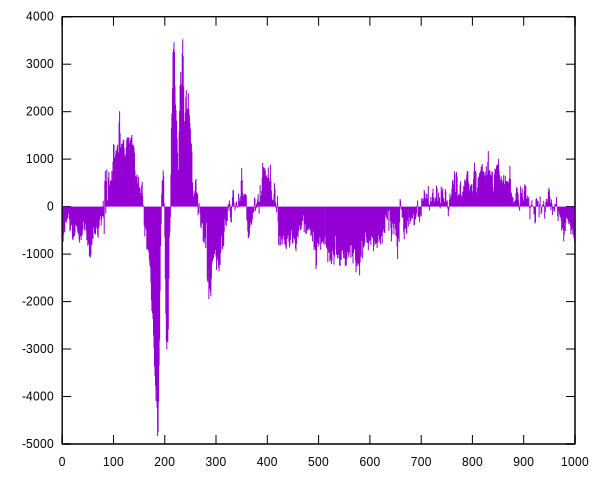
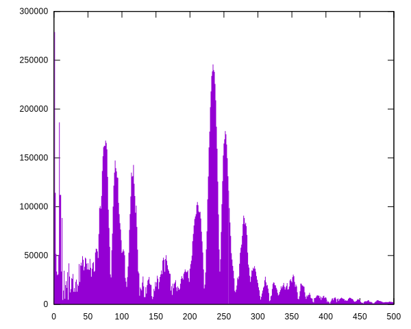

A Fourier transform implementation using no third-party libraries. Written to
analyse the spectral response of my digeridoo. Listen to the [audio](recording.wav).

- Read WAV
- Spectral analysis for whole sample
- Generate gnuplot of spectrum
- Animation of sample

# Samples

# Fourier

