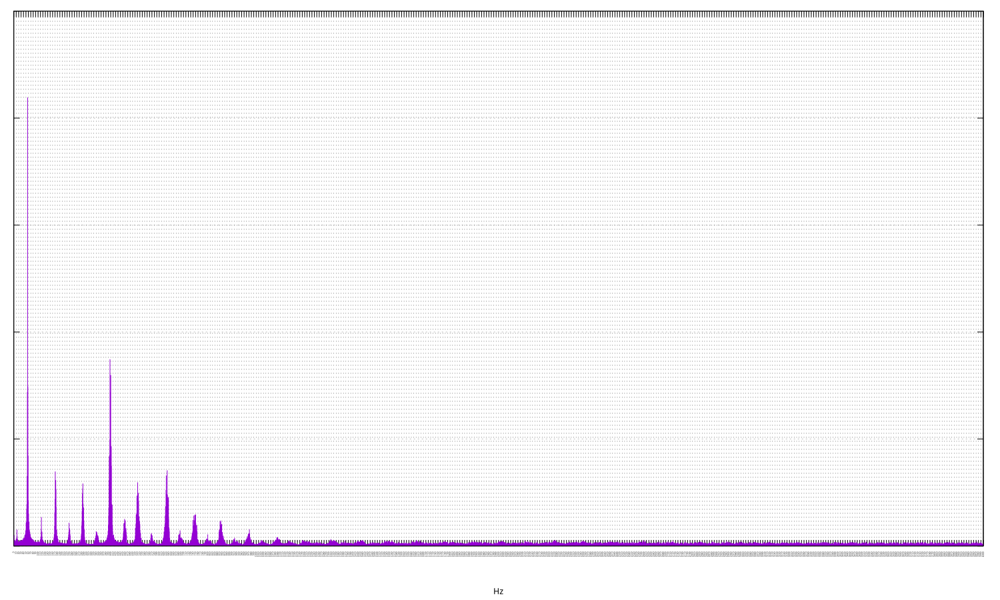
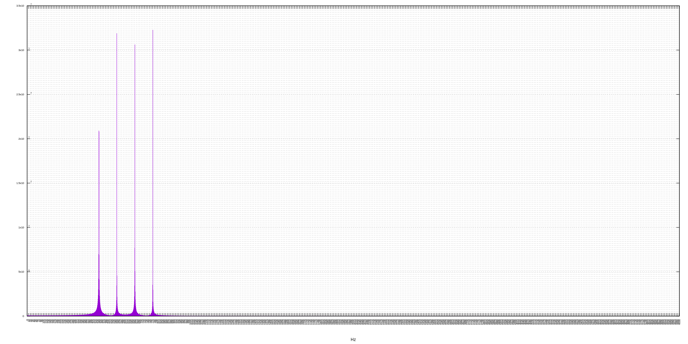
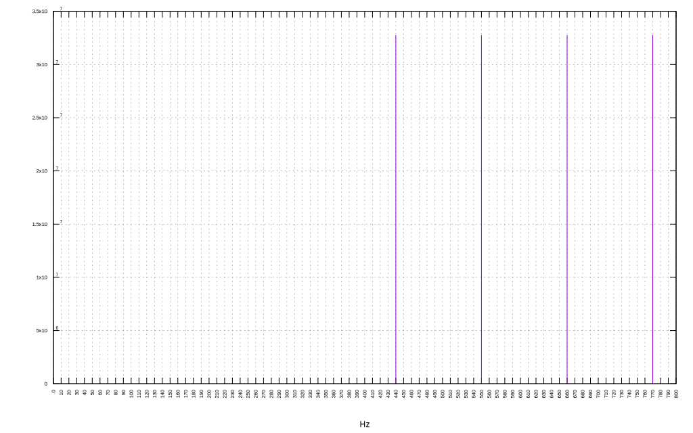
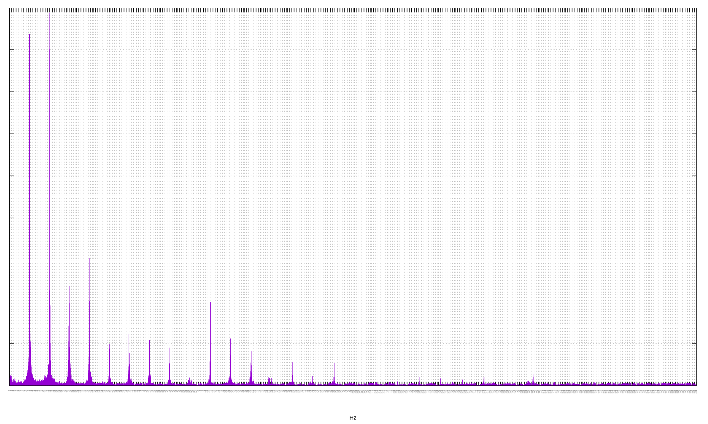
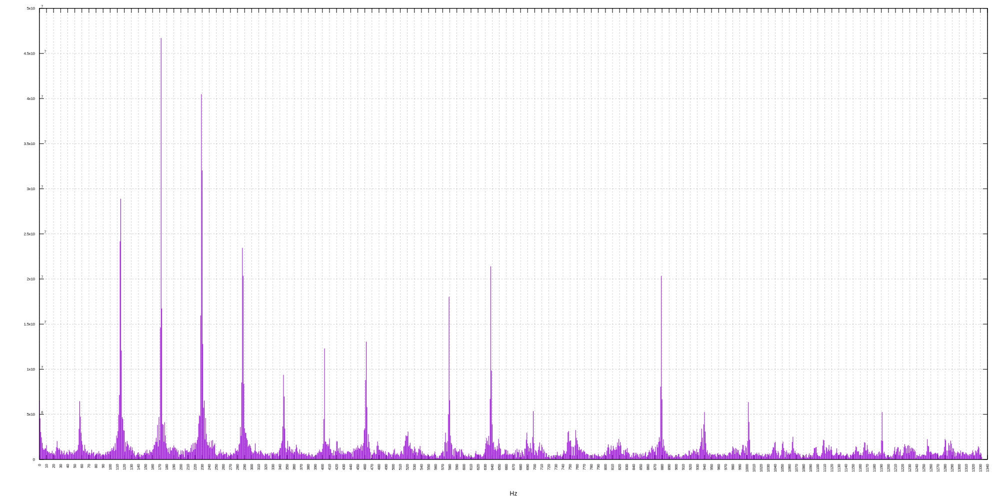

[](https://travis-ci.org/deanturpin/spectrum_analyser_gnuplot)
[](https://codecov.io/gh/deanturpin/spectrum_analyser_gnuplot)

A Fourier transform implementation using no third-party libraries. Written to
analyse the spectral response of my digeridoo. Listen to the [audio](recording.wav).

Samples recorded on my laptop with ```arecord```.
```bash
arecord -q -f S16_LE -c1 -r 8000 > recording.wav
```

See the [pitch details](pitch.md).

---

Wed  6 Jun 20:54:23 BST 2018
# didgeridoo_big_tony.wav
Listen to the [audio](wav/didgeridoo_big_tony.wav).
[](didgeridoo_big_tony.svg)
# major7_fractional_freqs.wav
Listen to the [audio](wav/major7_fractional_freqs.wav).
[](major7_fractional_freqs.svg)
# major7.wav
Listen to the [audio](wav/major7.wav).
[](major7.svg)
# piano2.wav
Listen to the [audio](wav/piano2.wav).
[](piano2.svg)
# piano.wav
Listen to the [audio](wav/piano.wav).
[](piano.svg)
