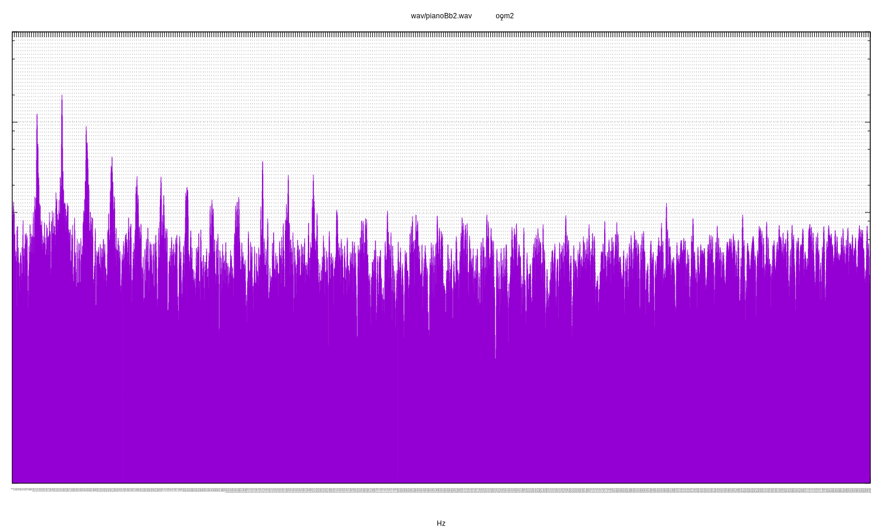

[](https://travis-ci.org/deanturpin/dft)
[](https://codecov.io/gh/deanturpin/dft)

A discrete Fourier transform implementation using no third-party libraries.
Initially written to study the spectral response of my digeridoo. See
[Wikipedia](https://en.wikipedia.org/wiki/Discrete_Fourier_transform) for the
algorithm. For each sample two plots are rendered: all Fourier bins and a second
zoomed into the first section. See the [pitch table](pitch.md) for concert pitch
frequencies.

---

Fri 15 Jun 08:29:39 BST 2018

# wav/bamboo_drone.wav_zoom2
Peaks at: 72, 143, 215, 286 and 357 Hz.

A cheap bamboo didge with a Sugru mouthpiece. Fundamental of 72 Hz, slightly
flat of D2, with a full compliment of harmonics across the whole tested
frequency range. Not a refined sound and quite hard to play but very responsive.

```
73.42	D2
146.83	D3
220.00	A3
293.66	D4
369.99	F#4
```
[](wav/bamboo_drone.wav_zoom2.svg)
# wav/didgeridoo_big_tony_drone.wav_zoom2
Peaks: 57, 172, 285, 398 Hz.

Fundamental of 57 Hz, slightly flat of concert Bb1. Next loudest peak is 398 Hz
(G4), which is a sixth interval in Bb Major. See [the
scale](https://en.wikipedia.org/wiki/B-flat_major) on Wikipedia.

This didgeridoo was liberated from the dump and is probably Eucalyptus:
woolybutt, bloodwood and stringybark have been discussed.

```
58.27	A#1
174.61	F3
293.66	D4
392.00	G4
```
[](wav/didgeridoo_big_tony_drone.wav_zoom2.svg)
# wav/didgeridoo_big_tony_toot.wav_zoom2
The toot has a fundamental of 178 Hz (F3) which is a fifth above the drone.
There's also lots of activity in the higher frequencies at least up to 4 KHz.
[](wav/didgeridoo_big_tony_toot.wav_zoom2.svg)
# wav/JF_fibreglass_slide.wav_zoom2
Peaks at: 81, 162, 243, 324 Hz.

A fundamental of 81 Hz, just flat of E2. Equal presence of first octave, fifth
(B3) and second octave. High frequency sparkle extends out as far as 1940 Hz.
Very pure harmonics.

```
82.41	E2
164.81	E3
246.94	B3
329.63	E4
```
[](wav/JF_fibreglass_slide.wav_zoom2.svg)
# wav/KP_guest.wav_zoom2
Fundamental of 82 Hz (E2) with two octaves and a fifth (B). There's also a
hint of 403 Hz (a slightly sharp G4): a minor third. See [the
scale][https://en.wikipedia.org/wiki/E_minor] on Wikipedia.

```
82.41	E2
164.81	E3
246.94	B3
329.63	E4
392.00	G4
```
[](wav/KP_guest.wav_zoom2.svg)
# wav/pianoBb1.wav_zoom2
[](wav/pianoBb1.wav_zoom2.svg)
# wav/pianoBb2.wav_zoom2
[](wav/pianoBb2.wav_zoom2.svg)
# wav/singing_bowl1.wav_zoom2
Fundamental of 468 Hz (close to A#4) and first octave of 936 Hz. The only bowl
with a pronounced octave. (Note that the second peak is off the right-hand side
of the second plot.)

```
466.16	A#4
932.33	A#5
```
[](wav/singing_bowl1.wav_zoom2.svg)
# wav/singing_bowl2.wav_zoom2
Fundamental of 89 Hz, close to F2. Significant peaks at 259 Hz and 517 Hz
(fifths). Very complex response, I suspect this is a hand-made metal bowl. (I
recorded the bowls in the dark so I'm not sure which video was which.)

```
87.31	F2
261.63	C4
523.25	C5
```
[](wav/singing_bowl2.wav_zoom2.svg)
# wav/singing_bowl3.wav_zoom2
Fundamental exactly 260 Hz (close to C4). Very pure, little harmonic noise.

```
261.63	C4
```
[](wav/singing_bowl3.wav_zoom2.svg)
# wav/singing_bowl5.wav_zoom2
Extremely pure fundamental of 297 Hz. Halfway between D4 and D#4.

```
293.66	D4
311.13	D#4
```
[](wav/singing_bowl5.wav_zoom2.svg)
# wav/synthesised_chord.wav_zoom2
[](wav/synthesised_chord.wav_zoom2.svg)
# wav/synthesised_chord_whole_freqs.wav_zoom2
[](wav/synthesised_chord_whole_freqs.wav_zoom2.svg)
