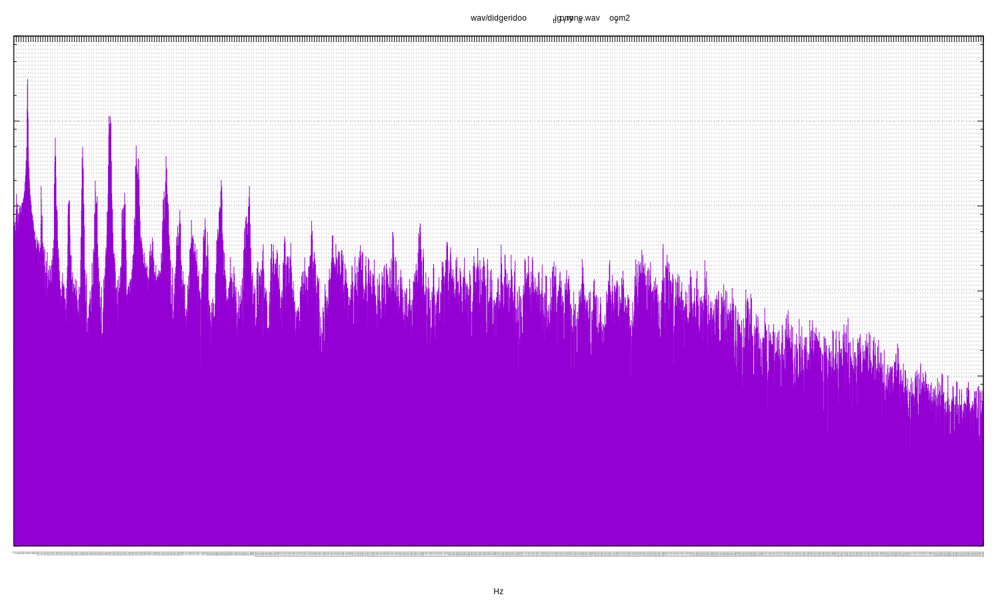
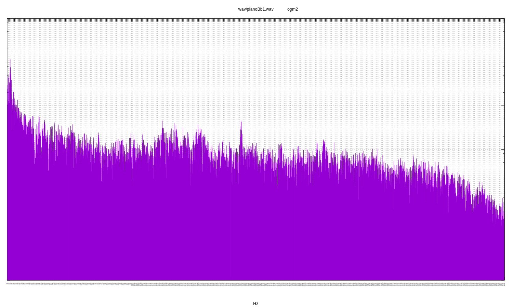

A discrete Fourier transform implementation using no third-party libraries.
Initially written to study the spectral response of my digeridoo. See
[Wikipedia](https://en.wikipedia.org/wiki/Discrete_Fourier_transform) for the
algorithm. For each sample two plots are rendered: all Fourier bins and a second
zoomed into the first section. See the [pitch table](pitch.md) for concert pitch
frequencies.

---

Thu 14 Jun 22:29:04 BST 2018

# wav/bamboo_drone.wav_zoom2

# wav/didgeridoo_big_tony_drone.wav_zoom2

# wav/didgeridoo_big_tony_toot.wav_zoom2

# wav/JF_fibreglass_slide.wav_zoom2

# wav/KP_guest.wav_zoom2

# wav/pianoBb1.wav_zoom2

# wav/pianoBb2.wav_zoom2

# wav/singing_bowl1.wav_zoom2

# wav/singing_bowl2.wav_zoom2

# wav/singing_bowl3.wav_zoom2

# wav/singing_bowl5.wav_zoom2

# wav/synthesised_chord.wav_zoom2

