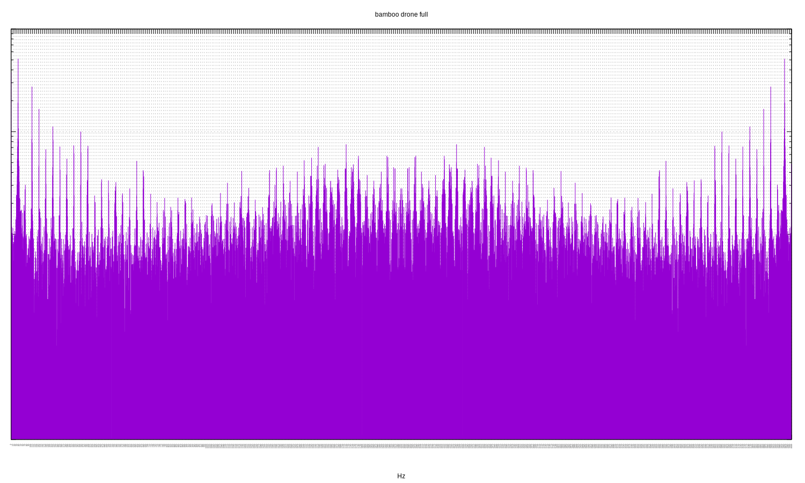
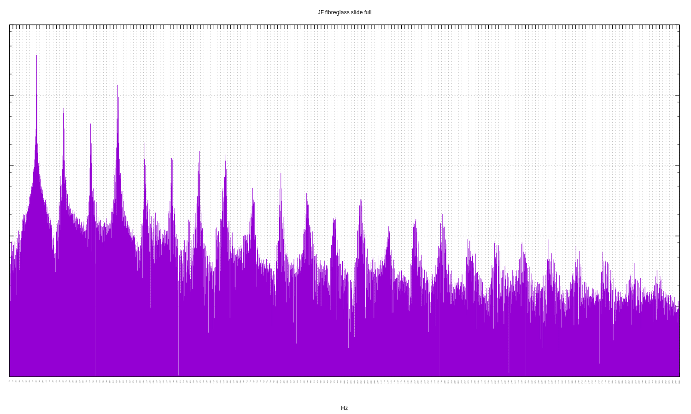
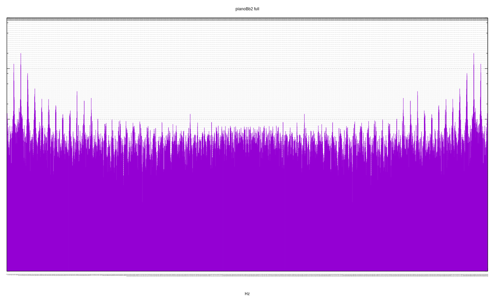
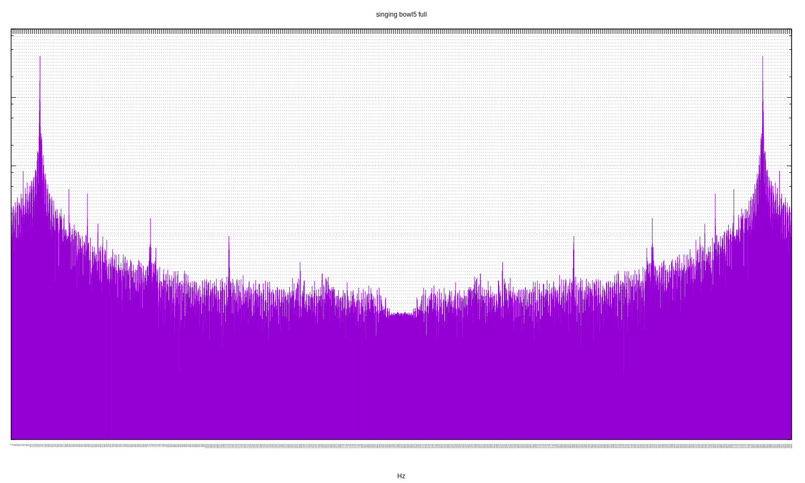

[](https://travis-ci.org/deanturpin/dft)
[](https://codecov.io/gh/deanturpin/dft)

A discrete Fourier transform implementation using no third-party libraries.
Initially written to study the spectral response of my digeridoo. See
[Wikipedia](https://en.wikipedia.org/wiki/Discrete_Fourier_transform) for the
algorithm. For each sample two plots are rendered: all Fourier bins and a second
zoomed into the first section. See the [pitch table](pitch.md) for concert pitch
frequencies.

---

Sun 10 Jun 11:57:32 BST 2018

# bamboo drone
Peaks at: 13, 38, 63, 89 Hz.

Hmmm, calculated fundamental of C# on the piano. Need to retest this.

```
38.89	D#1
65.41	C2
```
Listen to the [audio](wav/bamboo_drone.wav).
[](bamboo_drone_full.svg)
[](bamboo_drone_zoom.svg)
# didgeridoo big tony drone
Peaks: 57, 172, 285, 398 Hz.

Fundamental of 57 Hz, slightly flat of concert Bb1. Next loudest peak is 398
Hz (G4), which is a sixth interval in Bb Major. See [the scale](https://en.wikipedia.org/wiki/B-flat_major) on Wikipedia.

```
58.27	A#1
174.61	F3
293.66	D4
392.00	G4
```
Listen to the [audio](wav/didgeridoo_big_tony_drone.wav).
[](didgeridoo_big_tony_drone_full.svg)
[](didgeridoo_big_tony_drone_zoom.svg)
# didgeridoo big tony toot
The toot has a fundamental of 178 Hz (F3) which is a fifth above the drone.
There's also lots of activity in the higher frequencies at least up to 4 KHz.
Listen to the [audio](wav/didgeridoo_big_tony_toot.wav).
[](didgeridoo_big_tony_toot_full.svg)
[](didgeridoo_big_tony_toot_zoom.svg)
# JF fibreglass slide
Peaks at: 81, 162, 243, 324 Hz.

A fundamental of 81 Hz, just flat of E2. Equal presence of first octave, fifth
(B3) and second octave. High frequency sparkle extends out as far as 1940 Hz.
Very pure harmonics.

```
82.41	E2
164.81	E3
246.94	B3
329.63	E4
```
Listen to the [audio](wav/JF_fibreglass_slide.wav).
[](JF_fibreglass_slide_full.svg)
[](JF_fibreglass_slide_zoom.svg)
# KP guest
Fundamental of 82 Hz (E2) with two octaves and a fifth (B). There's also a
hint of 403 Hz (a slightly sharp G4): a minor third. See [the
scale][https://en.wikipedia.org/wiki/E_minor] on Wikipedia.

```
82.41	E2
164.81	E3
246.94	B3
329.63	E4
392.00	G4
```
Listen to the [audio](wav/KP_guest.wav).
[](KP_guest_full.svg)
[](KP_guest_zoom.svg)
# pianoBb1
Listen to the [audio](wav/pianoBb1.wav).
[](pianoBb1_full.svg)
[](pianoBb1_zoom.svg)
# pianoBb2
Listen to the [audio](wav/pianoBb2.wav).
[](pianoBb2_full.svg)
[](pianoBb2_zoom.svg)
# singing bowl1
Fundamental of 468 Hz (close to A#4) and first octave of 936 Hz. The only bowl
with a pronounced octave. (Note that the second peak is off the right-hand side
of the second plot.)

```
466.16	A#4
932.33	A#5
```
Listen to the [audio](wav/singing_bowl1.wav).
[](singing_bowl1_full.svg)
[](singing_bowl1_zoom.svg)
# singing bowl2
Fundamental of 89 Hz, close to F2. Significant peaks at 259 Hz and 517 Hz
(fifths). Very complex response, I suspect this is a hand-made metal bowl. (I
recorded the bowls in the dark so I'm not sure which video was which.)

```
87.31	F2
261.63	C4
523.25	C5
```
Listen to the [audio](wav/singing_bowl2.wav).
[](singing_bowl2_full.svg)
[](singing_bowl2_zoom.svg)
# singing bowl3
Fundamental exactly 260 Hz (close to C4). Very pure, little harmonic noise.

```
261.63	C4
```
Listen to the [audio](wav/singing_bowl3.wav).
[](singing_bowl3_full.svg)
[](singing_bowl3_zoom.svg)
# singing bowl5
Extremely pure fundamental of 298 Hz. Halfway between D4 and D#4.

```
293.66	D4
311.13	D#4
```
Listen to the [audio](wav/singing_bowl5.wav).
[](singing_bowl5_full.svg)
[](singing_bowl5_zoom.svg)
