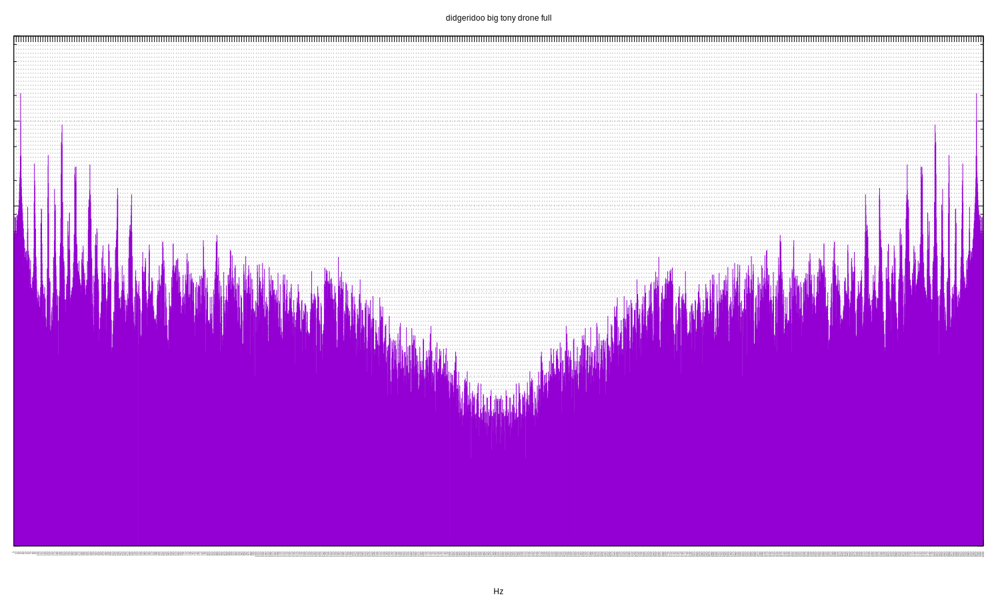
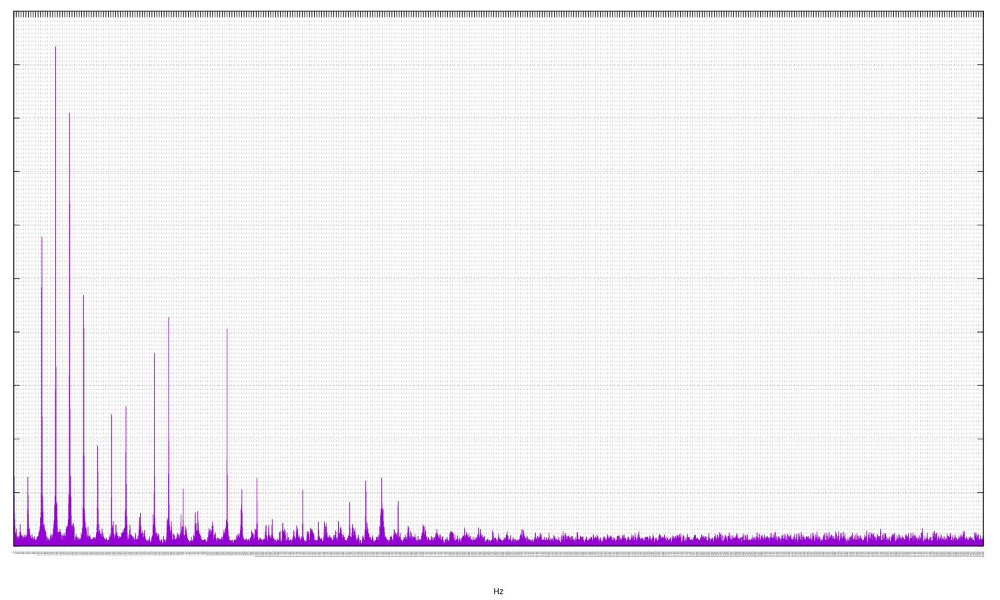

[](https://travis-ci.org/deanturpin/spectrum_analyser_gnuplot)
[](https://codecov.io/gh/deanturpin/spectrum_analyser_gnuplot)

A discrete Fourier transform implementation using no third-party libraries.
Initially written to study the spectral response of my digeridoo. See
[Wikipedia](https://en.wikipedia.org/wiki/Discrete_Fourier_transform) for the
algorithm.

Samples recorded on my Ubuntu laptop with ```arecord```.
```bash
arecord -q -f S16_LE -c1 -r 8000 > recording.wav
```

For each sample two plots are rendered: all Fourier bins and a second zoomed
into the first section.

See the [pitch table](pitch.md) for concert pitch frequencies.

---

Sat  9 Jun 03:12:08 BST 2018

# didgeridoo big tony drone full
Listen to the [audio](wav/didgeridoo_big_tony_drone.wav).
[](didgeridoo_big_tony_drone_full.svg)
[](didgeridoo_big_tony_drone_zoom.svg)
# didgeridoo big tony toot full
Listen to the [audio](wav/didgeridoo_big_tony_toot.wav).
[](didgeridoo_big_tony_toot_full.svg)
[](didgeridoo_big_tony_toot_zoom.svg)
# guitar open a full
Listen to the [audio](wav/guitar_open_a.wav).
[](guitar_open_a_full.svg)
[](guitar_open_a_zoom.svg)
# guitar open e full
Listen to the [audio](wav/guitar_open_e.wav).
[](guitar_open_e_full.svg)
[](guitar_open_e_zoom.svg)
# JF fibreglass slide full
Peaks at: 81, 162, 243, 324 Hz.

A strong fundamental at 81 Hz, just flat of E2. Textbook first octave followed
by a near perfect 5th (B3) and a strong second octave. High frequency sparkle
extends out as far as 1940 Hz.
Listen to the [audio](wav/JF_fibreglass_slide.wav).
[](JF_fibreglass_slide_full.svg)
[](JF_fibreglass_slide_zoom.svg)
# KP guest full
Starting on the left: it's just shy of concert pitch E, with two E octaves and a
B 5th. There's also a faint whiff of G on the right.
Listen to the [audio](wav/KP_guest.wav).
[](KP_guest_full.svg)
[](KP_guest_zoom.svg)
# major7 fractional freqs full
Listen to the [audio](wav/major7_fractional_freqs.wav).
[](major7_fractional_freqs_full.svg)
[](major7_fractional_freqs_zoom.svg)
# major7 precise freqs full
Listen to the [audio](wav/major7_precise_freqs.wav).
[](major7_precise_freqs_full.svg)
[](major7_precise_freqs_zoom.svg)
# piano2 full
Listen to the [audio](wav/piano2.wav).
[](piano2_full.svg)
[](piano2_zoom.svg)
# piano full
Listen to the [audio](wav/piano.wav).
[](piano_full.svg)
[](piano_zoom.svg)
# singing bowl1 full
Listen to the [audio](wav/singing_bowl1.wav).
[](singing_bowl1_full.svg)
[](singing_bowl1_zoom.svg)
# singing bowl2 full
Listen to the [audio](wav/singing_bowl2.wav).
[](singing_bowl2_full.svg)
[](singing_bowl2_zoom.svg)
# singing bowl3 full
Listen to the [audio](wav/singing_bowl3.wav).
[](singing_bowl3_full.svg)
[](singing_bowl3_zoom.svg)
# singing bowl4 full
Listen to the [audio](wav/singing_bowl4.wav).
[](singing_bowl4_full.svg)
[](singing_bowl4_zoom.svg)
# singing bowl5 full
Listen to the [audio](wav/singing_bowl5.wav).
[](singing_bowl5_full.svg)
[](singing_bowl5_zoom.svg)
